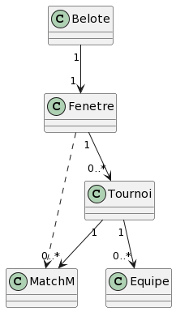

= Analyse de l'application
:toc:
:toc-title: Sommaire
:toclevels: 4

[underline]#Tilian HURÉ et Hugo WENDJANEH# *(2A)*

Ce document détaille la structure du code source existant de l'application, mais surtout les défauts et les possibles améliorations de ce dernier.

{empty} +

== Structure de l'application
[.text-justify]
Le code source de l'application ne dispose que de 5 classes toutes disposées dans un même répertoire.

* `Belote.jave` : Classe gérant la connexion avec une base de données utilisée l'application et gérant le lancement de cette dernière
* `Fenetre.java` : Classe écrite majoritairement en Java Swing et l'implémentant l'entièreté de l'interface graphique de l'application
* `Tournoi.java` : Classe gérant toute la manipulation des données de l'application (ajout de joueur, d'équipe, gestion des tournois, etc)
* `Equipe.java` : Classe implémentant une équipe de 2 joueurs
* `MatchM` : Classe implémentant un match entre 2 équipes

Diagramme de classes :

L'application utilise une dépendance `hsqldb.jar` lui permettant l'utilisation d'une base de données avec SQL.

== Défauts constatés
[.text-justify]
Cette partie détaille des principales défauts que notre équipe a pu relever dans le code source de l'application, ainsi que les possibles corrections de refactoring.

=== 1) Paternes et modèles de conception
==== 1.1) Modèle MVC
[.text-justify]
L'application utilisant une base de données, une interface graphique ainsi qu'un modèle de manipulation des données traitées, sa structure pourrait suivre le modèle de conception Model-View-Controller (MVC) plutôt que de garder tous ses fichiers ensembles. Le MVC permet de décomposer un projet avec un package `view` contenant toutes les classes gérant l'aspect graphique de l'application, un package `model` pour le traitement des données manipulées, et un package `control` pour les classes gérant les liaisons entre le traitement des données et l'interface.

==== 1.2) Paternes de programmation
[.text-justify]
Le code de l'application pourrait aussi utiliser certains paternes de programmation comme le paterne "Singleton" qui pourrait être utilisé pour forcer l'utilisation d'une seule instance de la classe `Fenetre.java`, voire le paterne "Factory" pour la création contrôlée de joueurs, d'équipes ou de tournois.

=== 2) Reformater et homogénéiser
==== 2.1) Reformater
[.text-justify]
L'entièreté du code source de l'application présente de gros défauts de lisibilités, que ce soit au niveau des noms de classe (`MatchM.java`), de variable (`t`, `st`, `e1`, etc) de fonctions, mais aussi en termes de respect de certaines normes. Par exemple, certains espaces et retours sont inutiles ou alors manquants et la tabulation n'est pas toujours respectée. Le code source pourrait être entièrement formaté pour devenir plus lisible en renommant les variables, les fonctions, mais aussi les classes en respectant certaines normes de nomenclature comme le camel case (camelCase).

==== 2.2) Homogénéiser
[.text-justify]
Le code source ne suit pas les mêmes normes d'une ligne à une autre d'une même classes ce qui complique également la compréhension du code. Par exemple, les attributs des classes sont placés n'importe où, il n'y a pas d'utilisation du `this.` ce qui complique la distinction des attributs d'une classe utilisés, ou encore les "_" sont utilisés devant les paramètres de certaines fonctions, mais pas toutes (bref, c'est la pagaille). Pour remédier à ça, notre équipe pourrait renommer les classes, fonctions et variables nécessaires, tout en reformattant le code de manière homogène.

=== 3) Créer plus de classes
[.text-justify]
L'application ne dispose que de 5 classes ce qui est très peu pour une application graphique en Java. D'autres classes pourraient être ajoutés comme une classe `Joueur.java` implémentant un joueur, ou encore une classe outil `Tools` regroupant plusieurs fonctions pratiques pouvant être utilisés intérieurement par le code et même extérieurement, comme avec la fonction `fonction mysql_real_escape_string` de la classe `Tournoi.java`.

=== 4) Éviter les redondances et simplifier
==== 4.1) Redondances
[.text-justify]
Le code source présente plusieurs redondances comme avec la ré-implémentation plutôt que la réutilisation de la classe `MatchM.java` en tant que classe interne `Match` dans les classes `Belote.java` et `Tournoi.java`. Certaines fonctions pourraient également être redondantes en effectuant plus ou moins les mêmes tâches.

==== 4.2) Simplifier
[.text-justify]
Certaines parties du code source de l'application pourrait être modifiées comme les structures `if` à la chaîne sur une même variable qui pourrait être changées en `switch` (`Fenetre.java`), ou dont la condition pourrait être simplifiée.

=== 5) Enlever les bouts de code inutiles
[.text-justify]
Certaines parties du code de l'application pourraient être simplement enlevées car inutiles, comme les parties redondantes, certains commentaires non pertinents et surtout les appels `System.out`. Ces derniers pourraient même être remplacés par des fenêtres popups explicites lorsque des exceptions sont levées.

=== 6) Développer des tests unitaires
[.text-justify]
Pour s'assurer du bon refactoring de l'application, que certaines fonctionnalités marchent toujours comme attendues, notre équipe pourrait développer une série de tests unitaires afin de vérifier le bon fonctionnement de chaque composant non-graphique de l'application (avec JUnit par exemple).

=== 7) Utiliser Maven et écrire la Javadoc
==== 7.1) Lancer l'application et les tests
[.text-justify]
Afin de faciliter la compilation et le lancement de l'application et de ses tests unitaires, il serait possible de convertir le projet en un projet Maven proposant des commandes permettant ces actions.

==== 7.2) Rédiger la Javadoc
[.text-justify]
En plus d'être très sale, le code source n'est que très peu commenté (voire pas du tout) et il n'y a pratiquement aucune Javadoc détaillant le but et le fonctionnement des classes et de leurs méthodes.

{empty} +

Notre équipe va donc se concentrer d'abord sur la réalisation de tests unitaires qui permettront ensuite d'assurer un refactoring complet et correct de l'application, après avoir planifié et réparti les tâches à réaliser.